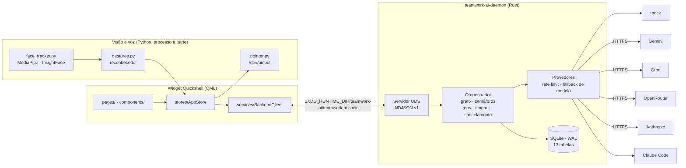

# Team Work AI

Uma pequena equipe de agentes de IA trabalhando no seu desktop Linux.

Um daemon em **Rust** orquestra vários agentes em paralelo — cada um com seu
provedor e modelo — e um widget **Quickshell/QML** mostra os avatares
trabalhando, com um chat pra conversar com a equipe e delegar tarefas:
`@forge implemente esta função`.

<p align="center">
  
</p>

**Sem Electron, sem navegador embutido, sem TCP.** Qt nativo sobre Wayland,
socket Unix, SQLite num arquivo. A única coisa que sai da máquina são as
chamadas às APIs de IA.

## O que ele faz

- **Equipe, não um modelo.** Escolha nenhum agente e um coordenador monta um
  plano em JSON — um grafo de subtarefas com dependências — e distribui. Escolha
  vários e todos trabalham em paralelo. Escolha um e vai direto nele.
- **A conversa tem memória.** Os últimos turnos entram no prompt, então dá pra
  dizer "e agora refatora isso" sem repetir o que é "isso". Persiste em SQLite:
  fecha e reabre o app, a conversa continua.
- **Cada agente tem memória permanente** entre execuções, ativa por padrão:
  consulta o que já aprendeu antes de responder e pode salvar descobertas, só
  suas ou compartilhadas com a equipe.
- **Presença por câmera e voz** (opcional): ele sabe se você está na frente da
  câmera e se é você, atende por "fala Jorginho", aceno ou palmas, e responde em
  voz com legenda.
- **Controle de janelas por gesto** pela mesma webcam — mover, rolar, arrastar
  e clicar com a mão. Ver [`docs/gestures.md`](docs/gestures.md).

## Arquitetura



As camadas dependem **num sentido só**: `protocol`, `domain` e `providers` não
dependem de nada; `storage` só conhece `domain`; só o `orchestrator` vê todo
mundo. O front não tem regra de negócio — renderiza estado e manda comando. O
Python só vê e reporta. Cada camada pode morrer sem levar as outras.

Detalhes em [`docs/architecture.md`](docs/architecture.md).

Agentes padrão: **Atlas** (coordenador), **Forge** (desenvolvedor), **Íris**
(pesquisadora), **Sentinel** (revisor), **Jorginho** (tech lead / revisor
sênior). Provedor e modelo são configuráveis por agente, a qualquer momento.

## Requisitos

**Linux com Wayland — obrigatório.** O widget usa Quickshell
(`wlr-layer-shell`) e o daemon usa socket Unix; nenhum dos dois roda em
**Windows**, **macOS** ou **X11** puro.

Testado em **Arch Linux** e **CachyOS** com o compositor **niri** (ver
[`docs/arch-cachyos-niri.md`](docs/arch-cachyos-niri.md)). Deve funcionar em
outros compositores wlr (Hyprland, Sway), mas só o niri foi validado — e o
controle por gesto depende dele especificamente, via `niri msg`.

| dependência | onde |
| --- | --- |
| Rust estável | `pacman -S rust` ou rustup |
| Quickshell + Qt 6 | AUR: `quickshell` ou `quickshell-git` |
| `just` (opcional) | os comandos do `Justfile` rodam direto também |
| Python 3 + venv | só para câmera/voz/gestos — `scripts/setup-facetrack.sh` |

## Começando (sem chave de API)

Não precisa de conta em lugar nenhum pra ver funcionando — o modo mock é
completo e determinístico.

```bash
cargo run -p teamwork-ai-daemon          # terminal 1 — daemon (modo mock)
quickshell -p apps/widget/shell.qml      # terminal 2 — widget
./scripts/demo.sh                        # terminal 3 — demonstração
```

Para instalar de verdade (binários, serviço systemd do usuário e o widget):

```bash
./scripts/install-user.sh
systemctl --user enable --now teamwork-ai-daemon
```

> **Arch/CachyOS:** se o `cargo build` falhar com
> ``linker `x86_64-linux-gnu-gcc` not found``, já está resolvido no
> `.cargo/config.toml` do repositório — o rustc empacotado procura um nome de
> linker que a distro não instala.

No chat do widget (ou via `twctl terminal "…"`):

```text
/help
@forge analise a estrutura do backend
@forge @sentinel analisem este código em paralelo
@atlas organize a equipe para propor melhorias
/assign iris compare as alternativas
/provider forge groq
/model forge <modelo-listado>
/cancel <task-id>
/clear                  # limpa a tela E o histórico da conversa
```

## Configurando as APIs

```bash
cp .env.example ~/.config/teamwork-ai/env && chmod 600 ~/.config/teamwork-ai/env
# edite GEMINI_API_KEY / GROQ_API_KEY / OPENROUTER_API_KEY / ANTHROPIC_API_KEY
systemctl --user restart teamwork-ai-daemon
```

**As chaves nunca entram no banco, no QML nem nos logs** — só o daemon as lê,
do ambiente ou desse arquivo.

Regras de custo: `allow_paid_models = false` por padrão; no OpenRouter apenas
modelos gratuitos (pricing 0 ou `:free`) são aceitos, sem fallback pago.
**Anthropic não tem tier gratuito**: exige `allow_paid_models = true` (mesma
flag do OpenRouter — ligar uma libera as duas). Limites e timeouts em
`config/teamwork-ai.example.toml`. Ver [`docs/providers.md`](docs/providers.md).

## Modos do widget

**Compacto** (pastilha na borda), **expandido** (chat + abas de
agentes/tarefas/config), **tela cheia** (sala de operações) e **copiloto**.

O chat é a tela principal nos dois primeiros: suas mensagens e as respostas da
equipe em bolhas, com o texto aparecendo enquanto é escrito. A coordenação
interna entre os agentes fica na aba **Bastidores** — perto, mas fora do fio da
conversa.

No **copiloto** fica só o rosto do Jorginho sobreposto à área de trabalho, no
monitor e borda escolhidos em Config. Ele não reserva espaço na tela e nunca
pede o foco do teclado — você segue digitando na janela de baixo enquanto ele
fica ali te olhando (e te seguindo com o olhar, se a câmera estiver ligada). Só
abre a boca quando você o chama: "fala Jorginho", aceno, palmas ou o botão do
microfone. A resposta sai em voz e em legenda sob o rosto, sem inflar pra tela
cheia.

Liga pelo botão 👁, pelo interruptor em Config, ou por IPC:
`qs ipc call teamwork copilot`.

## Controle por gesto

Mexe nas janelas com a mão, pela mesma webcam do avatar. Nada sai da máquina: o
reconhecimento roda local e do Python só saem os nomes dos gestos.

| gesto | ação |
| --- | --- |
| ✋ aberta, parada 0,5 s | entra no comando |
| ✋ desliza → ← ↑ ↓ | navega colunas · maximiza · tela cheia |
| ✌ 4 dedos (polegar recolhido) | rola a página — trava no eixo em que começou |
| ☝ polegar + indicador + médio | move o cursor; fechar o polegar clica |
| ✊ fecha a mão | pega a janela sob o cursor e arrasta |

Fechar janela **não** é um gesto: some da câmera qualquer caminho para uma ação
irreversível.

Documentação completa — poses, limiares, fluidez, diagnóstico e as decisões por
trás de cada trava — em [`docs/gestures.md`](docs/gestures.md).

## Modo mock

Sempre disponível, sem rede: respostas determinísticas, plano de coordenação
fixo (2 subtarefas paralelas + revisão), marcadores de teste `[fail]`,
`[fail-once]`, `[rate-limit]`, `[slow]`. **Toda a suíte de testes usa só o
mock** — nenhum teste toca a rede, a câmera ou um banco de verdade.

## Estrutura

```
apps/daemon          binários: teamwork-ai-daemon, twctl
apps/widget          QML (components/ pages/ services/ stores/ theme/)
                     services/*.py  voz, webcam e gestos (venv próprio, 100% local)
crates/protocol      NDJSON v1: requests, responses, eventos
crates/domain        Agent, Task, Run, mensagens, parser de comandos
crates/providers     trait AiProvider: mock, gemini, anthropic, claude-code,
                     openai-compat (Groq/OpenRouter); retry, rate limit
crates/storage       SQLite + migrations (13 tabelas)
crates/orchestrator  grafo, paralelismo, cancelamento, consolidação,
                     memória, conhecimento, web, arquivos, anexos
config/ packaging/ scripts/ docs/ assets/avatars/
```

## Testes

```bash
cargo test --workspace                           # 143 testes, sem internet
cd apps/widget/services
python3 -m unittest test_gestures test_pointer test_cameras test_wake   # 136

# o espelho da mão precisa do venv do rastreamento (opencv):
~/.local/share/teamwork-ai/facetrack/venv/bin/python -m unittest test_preview
```

Cobrem: parser de comandos, protocolo, grafo de dependências, execução paralela
real, cancelamento, timeout, retry/backoff, rate limiter, persistência e
migrações, falha parcial, consolidação, integração ponta a ponta via socket
(daemon + cliente + reinício com histórico), reconhecedor de gestos, ponteiro
virtual, palavra de ativação e listagem de câmeras.

## Segurança

Socket Unix `0600`, validação e limite de tamanho das mensagens, chaves só no
daemon, **nenhuma execução de shell**, escrita de arquivos restrita a um
workspace que você define, limites anti-loop entre agentes e cancelamento
global. Detalhes em [`docs/security.md`](docs/security.md).

## Limitações conhecidas

- Pausa é efetiva em fronteiras de etapa — não interrompe uma requisição HTTP
  em andamento.
- Sem autenticação no socket além das permissões de arquivo (usuário local).
- Uso de tokens em respostas com streaming é estimado localmente.
- O controle por gesto depende do niri (`niri msg`); em outros compositores wlr
  o resto funciona, mas os gestos de janela não.
- QML validado estaticamente (`qmllint` sem warnings); a validação visual é
  manual, no seu Quickshell.

## Roadmap

- [x] Streaming até a interface — deltas `agent.stream` ao vivo nos avatares
- [x] Ciclo revisão→correção multi-turno, até `max_reviews`
- [x] Editor de agentes no widget
- [x] Provedor Anthropic + agente Jorginho
- [x] Memória de conversa e memória permanente por agente
- [x] Controle de janelas por gesto
- [ ] Secret Service/libsecret para as chaves
- [ ] Transcrição de áudio (Groq) e entradas multimodais (Gemini)
- [ ] Frontend para Windows, fora do Quickshell, no mesmo daemon — exige trocar
      o socket Unix por named pipe ou TCP local

## Documentação

[`architecture.md`](docs/architecture.md) ·
[`protocol.md`](docs/protocol.md) ·
[`providers.md`](docs/providers.md) ·
[`security.md`](docs/security.md) ·
[`gestures.md`](docs/gestures.md) ·
[`arch-cachyos-niri.md`](docs/arch-cachyos-niri.md)

Contribuições: [`CONTRIBUTING.md`](CONTRIBUTING.md). Licença: MIT.
