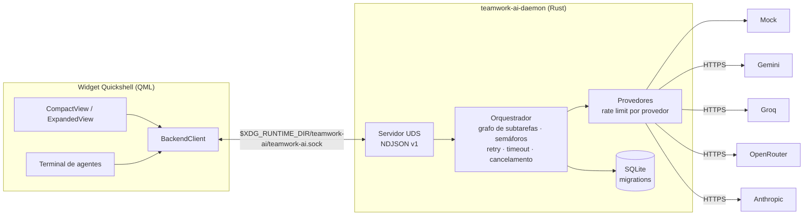

# Team Work AI

Uma pequena equipe de agentes de IA trabalhando no seu desktop Linux.
Daemon em **Rust** orquestra agentes em paralelo (Gemini, Groq, OpenRouter,
Anthropic ou modo simulado); um widget **Quickshell/QML** mostra os avatares trabalhando,
com terminal para delegar tarefas: `@forge implemente esta função`. Cada
agente tem uma **memória permanente** entre execuções (ativa por padrão,
sem configuração) — consulta o que já aprendeu antes de responder e pode
salvar descobertas, só suas ou compartilhadas com a equipe.

**Estado atual:** MVP funcional — Fases 1–3 completas (daemon, provedores
reais, orquestração), Fase 4 implementada em QML (validar no seu Quickshell),
Fase 5 entregue (systemd, PKGBUILD, docs). 92 testes passando sem rede.

## Arquitetura



Agentes padrão: **Atlas** (coordenador), **Forge** (desenvolvedor),
**Íris** (pesquisadora), **Sentinel** (revisor), **Jorginho** (tech lead —
revisor sênior, usa o provedor Anthropic). Provedor e modelo são
configuráveis por agente, a qualquer momento.

## Tecnologias

Rust (tokio, reqwest+rustls, rusqlite, tracing, thiserror), QML/Qt Quick via
Quickshell (Wayland/wlr-layer-shell), SQLite, NDJSON sobre Unix socket.
Sem Electron, sem game engine, sem TCP.

## Requisitos e compatibilidade

**Sistema operacional:** Linux com **Wayland** — obrigatório. O widget usa
Quickshell (protocolo `wlr-layer-shell`) e o daemon usa socket Unix; nenhum
dos dois roda em **Windows**, **macOS** ou sessões **X11** puras. Testado em
**Arch Linux** e **CachyOS** com o compositor **Niri** (ver
`docs/arch-cachyos-niri.md`); deve funcionar em outros compositores wlr
(Hyprland, Sway, etc.), mas só Niri foi validado na prática.

Suporte a Windows está no roadmap como um **frontend separado** (fora do
Quickshell) conversando com o mesmo daemon Rust — ainda não implementado.

**Dependências:**
- Rust estável (Arch: `pacman -S rust` ou rustup)
- Quickshell + Qt 6 (Arch: AUR `quickshell` ou `quickshell-git`)
- `just` opcional (roda os comandos do `Justfile` diretamente também)

## Execução rápida (sem chave de API)

```bash
cargo run -p teamwork-ai-daemon          # terminal 1 — daemon (modo mock)
quickshell -p apps/widget/shell.qml      # terminal 2 — widget
./scripts/demo.sh                        # terminal 3 — demonstração
```

No terminal do widget (ou via `twctl terminal "…"`):

```text
/help
@forge analise a estrutura do backend
@forge @sentinel analisem este código em paralelo
@atlas organize a equipe para propor melhorias
/assign iris compare as alternativas
/provider forge groq
/model forge <modelo-listado>
/cancel <task-id>
```

## Modos do widget

Compacto (pastilha na borda), expandido (abas + terminal), tela cheia (sala de
operações) e **copiloto**.

No copiloto fica só o rosto do Jorginho sobreposto à área de trabalho, no
monitor e borda escolhidos em Config. Ele não reserva espaço na tela e nunca
pede o foco do teclado — você segue digitando na janela de baixo enquanto ele
fica ali te olhando (e te seguindo com o olhar, se a câmera estiver ligada).
Só abre a boca quando você o chama: "fala Jorginho", aceno, palmas ou o botão
do microfone. A resposta sai em voz e em legenda sob o rosto, **sem** inflar
pra tela cheia como nos outros modos.

Liga pelo botão 👁 (compacto ou expandido), pelo interruptor em Config, ou por
IPC: `qs ipc call teamwork copilot`. Passe o mouse em cima pra ver os controles
(microfone, ativação por voz, voltar ao widget, fechar).

## Configuração das APIs (opcional)

```bash
cp .env.example ~/.config/teamwork-ai/env && chmod 600 ~/.config/teamwork-ai/env
# edite GEMINI_API_KEY / GROQ_API_KEY / OPENROUTER_API_KEY / ANTHROPIC_API_KEY
systemctl --user restart teamwork-ai-daemon
```

Regras de custo: `allow_paid_models = false` por padrão; no OpenRouter apenas
modelos gratuitos (pricing 0 ou `:free`) são aceitos — sem fallback pago.
**Anthropic não tem tier gratuito**: exige `allow_paid_models = true` pra ser
usado de verdade (mesma flag do OpenRouter — ligar uma libera as duas).
Limites e timeouts em `config/teamwork-ai.example.toml`.

## Modo mock

Sempre disponível, sem rede: respostas determinísticas, plano de coordenação
fixo (2 subtarefas paralelas + revisão), marcadores de teste `[fail]`,
`[fail-once]`, `[rate-limit]`, `[slow]`. Toda a suíte de testes usa só o mock.

## Comandos

`just dev · daemon · demo · widget · test · lint · check · fmt · build ·
install-user · uninstall-user · logs · status` — ver `Justfile`.

## Estrutura

```
apps/daemon      binários: teamwork-ai-daemon, twctl
apps/widget      QML (components/ pages/ services/ stores/ theme/)
crates/protocol  NDJSON v1: requests, responses, eventos
crates/domain    Agent, Task, Run, mensagens, parser de comandos
crates/providers AiProvider: mock, gemini, groq, openrouter, anthropic; retry, rate limit
crates/storage   SQLite + migrations (12 tabelas)
crates/orchestrator  grafo, paralelismo, cancelamento, consolidação
config/ packaging/ scripts/ docs/ assets/avatars/
```

## Testes

```bash
cargo test --workspace   # 92 testes, sem internet
```

Cobrem: parser de comandos, protocolo, grafo de dependências, execução
paralela real, cancelamento, timeout, retry/backoff, rate limiter, mock,
persistência/migrations, falha parcial, consolidação e integração de ponta a
ponta via socket (daemon + cliente + cancelamento + reinício com histórico).

## Segurança (resumo)

Unix socket 0600, validação e limite de tamanho de mensagens, chaves só no
daemon (nunca no QML/banco/logs), nenhuma execução de shell, limites
anti-loop entre agentes, cancelamento global. Detalhes: `docs/security.md`.

## Limitações conhecidas

- Pausa é efetiva em fronteiras de etapa (não interrompe uma requisição HTTP).
- QML validado estaticamente (qmllint sem warnings); valide visualmente no
  seu Quickshell (`just widget`).
- Sem autenticação no socket além das permissões de arquivo (usuário local).
- Uso de tokens em respostas com streaming é estimado localmente.

## Roadmap

1. ~~Streaming até a interface~~ ✅ — deltas `agent.stream` (transientes)
   aparecem ao vivo nas falas dos avatares e nos cartões.
2. ~~Ciclo revisão→correção multi-turno~~ ✅ — veredicto APROVADO/CORRIGIR,
   correções pelos agentes originais e nova revisão, até `max_reviews`.
3. ~~Editor de agentes no widget~~ ✅ — criar, editar (nome/função/prompt),
   escolher avatar e ativar/desativar pela aba Agentes.
4. ~~Provedor Anthropic + agente Jorginho~~ ✅ — tech lead/revisor sênior
   (`Capability::Review`, mesmo mecanismo do Sentinel); requer
   `ANTHROPIC_API_KEY` + `allow_paid_models = true` (sem tier gratuito).
5. Secret Service/libsecret para chaves.
6. Transcrição de áudio (Groq) e entradas multimodais (Gemini).
7. Frontend para Windows 11 (fora do Quickshell) conversando com o mesmo
   daemon Rust — exige trocar o socket Unix por named pipe/TCP local.

## Documentação

`docs/architecture.md` · `docs/protocol.md` · `docs/providers.md` ·
`docs/security.md` · `docs/arch-cachyos-niri.md`

Licença: MIT.
