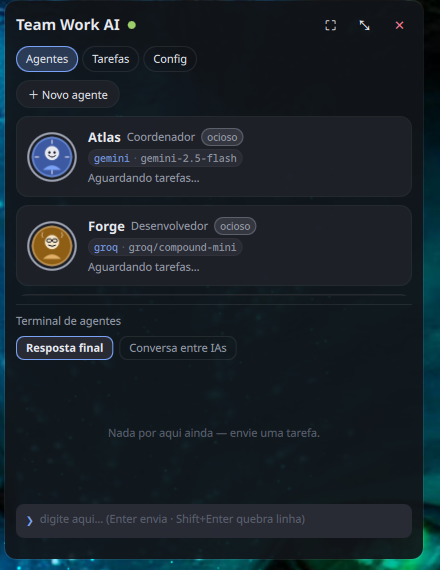
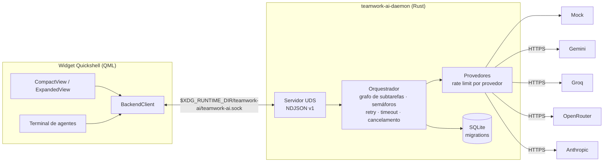

# Team Work AI

Uma pequena equipe de agentes de IA trabalhando no seu desktop Linux.
Daemon em **Rust** orquestra agentes em paralelo (Gemini, Groq, OpenRouter,
Anthropic ou modo simulado); um widget **Quickshell/QML** mostra os avatares trabalhando,
com um **chat** para conversar com a equipe e delegar tarefas:
`@forge implemente esta função`. A conversa tem memória — os últimos turnos vão
no prompt, então dá pra dizer "e agora refatora isso" sem repetir o que é
"isso" — e continua onde parou quando você fecha e reabre o app. Cada agente
tem ainda uma **memória permanente** entre execuções (ativa por padrão, sem
configuração) — consulta o que já aprendeu antes de responder e pode salvar
descobertas, só suas ou compartilhadas com a equipe.

<p align="center">
  
</p>

**Estado atual:** MVP funcional — Fases 1–3 completas (daemon, provedores
reais, orquestração), Fase 4 implementada em QML (validar no seu Quickshell),
Fase 5 entregue (systemd, PKGBUILD, docs). 105 testes passando sem rede.

## Arquitetura



Agentes padrão: **Atlas** (coordenador), **Forge** (desenvolvedor),
**Íris** (pesquisadora), **Sentinel** (revisor), **Jorginho** (tech lead —
revisor sênior, usa o provedor Anthropic). Provedor e modelo são
configuráveis por agente, a qualquer momento.

## Tecnologias

Rust (tokio, reqwest+rustls, rusqlite, tracing, thiserror), QML/Qt Quick via
Quickshell (Wayland/wlr-layer-shell), SQLite, NDJSON sobre Unix socket.
Sem Electron, sem game engine, sem TCP.

## Requisitos e compatibilidade

**Sistema operacional:** Linux com **Wayland** — obrigatório. O widget usa
Quickshell (protocolo `wlr-layer-shell`) e o daemon usa socket Unix; nenhum
dos dois roda em **Windows**, **macOS** ou sessões **X11** puras. Testado em
**Arch Linux** e **CachyOS** com o compositor **Niri** (ver
`docs/arch-cachyos-niri.md`); deve funcionar em outros compositores wlr
(Hyprland, Sway, etc.), mas só Niri foi validado na prática.

Suporte a Windows está no roadmap como um **frontend separado** (fora do
Quickshell) conversando com o mesmo daemon Rust — ainda não implementado.

**Dependências:**
- Rust estável (Arch: `pacman -S rust` ou rustup)
- Quickshell + Qt 6 (Arch: AUR `quickshell` ou `quickshell-git`)
- `just` opcional (roda os comandos do `Justfile` diretamente também)

## Execução rápida (sem chave de API)

```bash
cargo run -p teamwork-ai-daemon          # terminal 1 — daemon (modo mock)
quickshell -p apps/widget/shell.qml      # terminal 2 — widget
./scripts/demo.sh                        # terminal 3 — demonstração
```

No chat do widget (ou via `twctl terminal "…"`):

```text
/help
@forge analise a estrutura do backend
@forge @sentinel analisem este código em paralelo
@atlas organize a equipe para propor melhorias
/assign iris compare as alternativas
/provider forge groq
/model forge <modelo-listado>
/cancel <task-id>
/clear                  # limpa a tela E o histórico da conversa
```

## Modos do widget

Compacto (pastilha na borda), expandido (chat + abas de agentes/tarefas/config),
tela cheia (sala de operações) e **copiloto**.

O chat é a tela principal nos dois primeiros: suas mensagens e as respostas da
equipe em bolhas, com o texto aparecendo enquanto é escrito. A coordenação
interna entre os agentes fica na aba **Bastidores** — perto, mas fora do fio da
conversa.

No copiloto fica só o rosto do Jorginho sobreposto à área de trabalho, no
monitor e borda escolhidos em Config. Ele não reserva espaço na tela e nunca
pede o foco do teclado — você segue digitando na janela de baixo enquanto ele
fica ali te olhando (e te seguindo com o olhar, se a câmera estiver ligada).
Só abre a boca quando você o chama: "fala Jorginho", aceno, palmas ou o botão
do microfone. O aceno pode ser desligado em Config → Câmera ("Acenar chama o
Jorginho"), útil quando a câmera fica ligada o dia todo. A resposta sai em voz e em legenda sob o rosto, **sem** inflar
pra tela cheia como nos outros modos.

Liga pelo botão 👁 (compacto ou expandido), pelo interruptor em Config, ou por
IPC: `qs ipc call teamwork copilot`. Passe o mouse em cima pra ver os controles
(microfone, ativação por voz, voltar ao widget, fechar).

## Controle de janelas por gesto

Mexe nas janelas do compositor com a mão, pela **mesma webcam** que o avatar já
usa para olhar pra você — sem hardware novo e sem enviar nada pra fora: o
reconhecimento roda local, e do Python só saem os nomes dos gestos.

Ligue em **Config → Controle por gesto** (precisa da câmera ligada). Depende do
[niri](https://github.com/YaLTeR/niri), que recebe as ações por `niri msg`.

| gesto | ação |
| --- | --- |
| ✋ desliza → / ← | próxima coluna / coluna anterior |
| ✋ desliza ↑ | maximiza a coluna |
| ✋ desliza ↓ | tela cheia |
| ☝ **polegar + indicador + médio** | move o cursor do mouse |
| ☝ **fecha o polegar** | clica — mantido fechado, segura o clique |
| ✊ **fecha a mão** | pega a janela sob o cursor |
| ✊ **move** | a janela acompanha a mão |
| ✋ **abre a mão** | solta a janela onde estiver |

A mão de ponteiro (polegar, indicador e médio levantados; anelar e mindinho
dobrados) vira um mouse no ar: o cursor acompanha a mão, e o **polegar é o
botão** — fechou, clicou; mantido fechado, segura o clique, então dá para
arrastar e selecionar como num trackpad. É também como se mira numa janela
antes de fechar a mão inteira para pegá-la.

O arrasto é literalmente o **Super + arrastar do mouse**: como o niri não expõe
o arrasto interativo por IPC, um ponteiro virtual (`/dev/uinput`) pressiona
Super + botão esquerdo e move o cursor — o compositor faz o resto, exatamente
como se você estivesse arrastando com a mão no mouse. Fechar a mão é o botão
descendo; abrir é soltar.

Fechar janela **não** é um gesto: some da câmera qualquer caminho para uma ação
irreversível. O teclado dá conta disso, e um falso positivo custaria trabalho
não salvo.

**Levante a mão aberta e segure meio segundo pra entrar no comando**: aparece um selo na
tela dizendo que a mão está no comando, e a partir daí os gestos valem. Três
segundos sem gesto desarma sozinho. Sem essa trava, gesticular numa conversa
jogaria suas janelas pra outro monitor.

Outras travas: um rosto reconhecido como *não sendo você* não comanda nada, e
fechar janela nunca executa direto — vira uma confirmação na tela, que expira
sozinha em 12 s mantendo a janela aberta.

Requer o modelo de mãos (`hand_landmarker.task`) e, para o arrasto, o pacote
`evdev` com permissão de escrita em `/dev/uinput` — tudo instalado/verificado
por `scripts/setup-facetrack.sh`. Numa sessão de desktop comum a permissão do
uinput vem por ACL do seat, sem root nem grupo extra (`getfacl /dev/uinput`).
Sem ela, os outros gestos funcionam e só o arrasto fica de fora.

**Ver a mão sendo captada**: em Config, logo abaixo do interruptor do controle
por gesto, ligue *"Mostrar a câmera e os traços da mão ao gesticular"*. Aparece
um quadro sobre a área de trabalho com a imagem da webcam e o esqueleto
detectado desenhado por cima, mais o que falta para comandar ("mão aberta —
segure parada" → "no comando — deslize"). A imagem vai para a memória da sessão
(`$XDG_RUNTIME_DIR`), nunca para o disco, e só enquanto há mão no quadro.

**Se um gesto não pegar, rode o diagnóstico antes de mexer em limiar:**

```bash
./scripts/gesture-doctor.sh      # Ctrl+C encerra; nada é executado
```

Ele mostra ao vivo a taxa real de quadros, se a câmera está vendo sua mão e em
que pose, e qual comando cada gesto teria disparado. A taxa importa mais do que
parece: os limiares assumem ~6 quadros/s (medido numa Intel UHD com
FaceLandmarker + HandLandmarker + reconhecimento de identidade no mesmo laço).
Abaixo disso, um deslize não junta amostras suficientes — o diagnóstico avisa.

Para o detalhe quadro a quadro, `TEAMWORK_FACE_DEBUG=1` grava em
`~/.local/share/teamwork-ai/facetrack/wave-debug.log` (desligado por padrão:
o arquivo cresce sem limite).

## Configuração das APIs (opcional)

```bash
cp .env.example ~/.config/teamwork-ai/env && chmod 600 ~/.config/teamwork-ai/env
# edite GEMINI_API_KEY / GROQ_API_KEY / OPENROUTER_API_KEY / ANTHROPIC_API_KEY
systemctl --user restart teamwork-ai-daemon
```

Regras de custo: `allow_paid_models = false` por padrão; no OpenRouter apenas
modelos gratuitos (pricing 0 ou `:free`) são aceitos — sem fallback pago.
**Anthropic não tem tier gratuito**: exige `allow_paid_models = true` pra ser
usado de verdade (mesma flag do OpenRouter — ligar uma libera as duas).
Limites e timeouts em `config/teamwork-ai.example.toml`.

## Modo mock

Sempre disponível, sem rede: respostas determinísticas, plano de coordenação
fixo (2 subtarefas paralelas + revisão), marcadores de teste `[fail]`,
`[fail-once]`, `[rate-limit]`, `[slow]`. Toda a suíte de testes usa só o mock.

## Comandos

`just dev · daemon · demo · widget · test · lint · check · fmt · build ·
install-user · uninstall-user · logs · status` — ver `Justfile`.

## Estrutura

```
apps/daemon      binários: teamwork-ai-daemon, twctl
apps/widget      QML (components/ pages/ services/ stores/ theme/)
                 services/*.py  voz, webcam e gestos (venv próprio, 100% local)
crates/protocol  NDJSON v1: requests, responses, eventos
crates/domain    Agent, Task, Run, mensagens, parser de comandos
crates/providers AiProvider: mock, gemini, groq, openrouter, anthropic; retry, rate limit
crates/storage   SQLite + migrations (12 tabelas)
crates/orchestrator  grafo, paralelismo, cancelamento, consolidação
config/ packaging/ scripts/ docs/ assets/avatars/
```

## Testes

```bash
cargo test --workspace                          # sem internet
python3 apps/widget/services/test_gestures.py   # reconhecedor de gestos
python3 apps/widget/services/test_wake.py       # gatilho da ativação por voz
python3 apps/widget/services/test_pointer.py   # ponteiro virtual do arrasto

# precisa do venv do rastreamento (opencv):
~/.local/share/teamwork-ai/facetrack/venv/bin/python \
    apps/widget/services/test_preview.py        # espelho da mão
```

O reconhecedor de gestos é testado sem câmera: `gestures.py` só recebe posições
e poses, então as trajetórias dos testes são sintéticas — é o que permite
verificar que um aceno não vira um comando, que um movimento lento não vira
deslize e que a mão precisa estar armada, sem depender de acenar pra webcam.

Cobrem: parser de comandos, protocolo, grafo de dependências, execução
paralela real, cancelamento, timeout, retry/backoff, rate limiter, mock,
persistência/migrations, falha parcial, consolidação e integração de ponta a
ponta via socket (daemon + cliente + cancelamento + reinício com histórico).

## Segurança (resumo)

Unix socket 0600, validação e limite de tamanho de mensagens, chaves só no
daemon (nunca no QML/banco/logs), nenhuma execução de shell, limites
anti-loop entre agentes, cancelamento global. Detalhes: `docs/security.md`.

## Limitações conhecidas

- Pausa é efetiva em fronteiras de etapa (não interrompe uma requisição HTTP).
- QML validado estaticamente (qmllint sem warnings); valide visualmente no
  seu Quickshell (`just widget`).
- Sem autenticação no socket além das permissões de arquivo (usuário local).
- Uso de tokens em respostas com streaming é estimado localmente.

## Roadmap

1. ~~Streaming até a interface~~ ✅ — deltas `agent.stream` (transientes)
   aparecem ao vivo nas falas dos avatares e nos cartões.
2. ~~Ciclo revisão→correção multi-turno~~ ✅ — veredicto APROVADO/CORRIGIR,
   correções pelos agentes originais e nova revisão, até `max_reviews`.
3. ~~Editor de agentes no widget~~ ✅ — criar, editar (nome/função/prompt),
   escolher avatar e ativar/desativar pela aba Agentes.
4. ~~Provedor Anthropic + agente Jorginho~~ ✅ — tech lead/revisor sênior
   (`Capability::Review`, mesmo mecanismo do Sentinel); requer
   `ANTHROPIC_API_KEY` + `allow_paid_models = true` (sem tier gratuito).
5. Secret Service/libsecret para chaves.
6. Transcrição de áudio (Groq) e entradas multimodais (Gemini).
7. Frontend para Windows 11 (fora do Quickshell) conversando com o mesmo
   daemon Rust — exige trocar o socket Unix por named pipe/TCP local.

## Documentação

`docs/architecture.md` · `docs/protocol.md` · `docs/providers.md` ·
`docs/security.md` · `docs/arch-cachyos-niri.md`

Licença: MIT.
